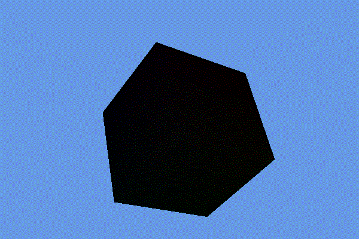

# FirstDX12Renderer
A series of examples on how to use Direct3D 12 for real-time graphics applications (e.g. videogames).\\
The examples will start from an empty window, and increase in complexity up to handle most of the base concepts when using this graphics API.
## Base CMake Project Configuration
  - Part1, Part2 and Part3 are target executables. These targets have dependencies on defined target libraries (both internal and external).
  - GEPUtils (Game Engine Programming Utilities) is the library that contains most of the graphics functions.
  - You can read my [CMake Configuration Article](https://logins.github.io/programming/2020/05/17/CMakeInVisualStudio.html).
# Part 1
Part1 executable project is the simplest, an empty window that will showcase: 
- **Handling a winapi window** with a D3D12 pipeline state object.
- **Window resizing** (and handling relative swapchain).
- **Reacting to input events** from mouse and keyboard.

# Part 2
Part2 executable target will showcase:
- **Render a cube** using vertex and index buffer.
- **Rotation and translation** upon mouse interaction.
- **Root signature** with a root constant.
- **Vertex and pixel shader** assigning color from per-vertex data.

# Part 3
Part3 executable target will have most of Part2 features, plus:
- **Full graphics abstraction layer** the app is potentially extensible to other APIs such as Vulkan.
- **Dynamic buffer** to handle data that is changing once per frame, such as a pulsing color.
- **Descriptor heap** staging descriptors on CPU and upload them to GPU when needed.
- **Constant buffer view** referenced by a root table in the root signature.

# Part 4
Part4 executable target will have most of Part3 features, plus:
- **Texture Handling** first loading a cubemap from a file and then uploading it to GPU.
- **Static Descriptor** to sample the texture in shader.

# Notes
>Note: This repo was tested in VisualStudio 2019 using FolderView Mode and CMake (Ninja generator + msvc compiler).

>Note: Part of D3D12 code was heavily inspired to the 3DGEP DirectX12 guides, by Jeremiah van Oosten, [you can find them by clicking here](https://www.3dgep.com/learning-directx-12-1/). He also has a corresponding GitHub repo, that [can be found here](https://github.com/jpvanoosten/LearningDirectX12/tree/v0.0.1).

>Note: Code you will find is solely my own and does not express the views or opinions of my employer.
